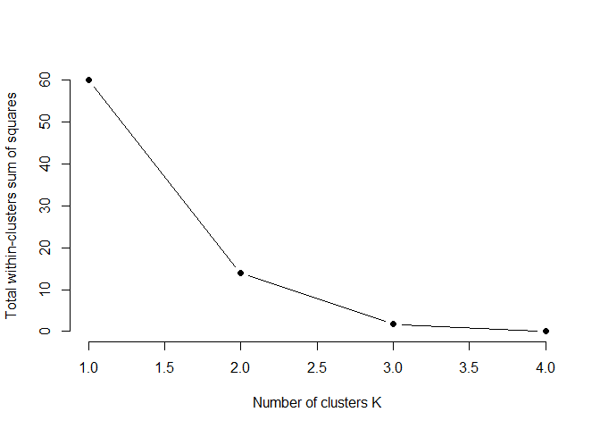
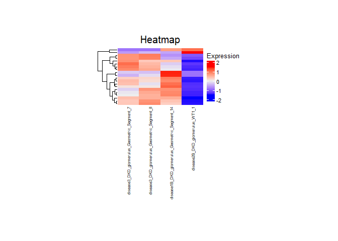
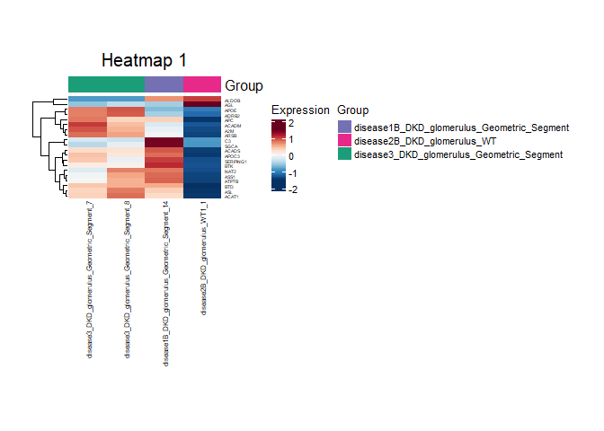
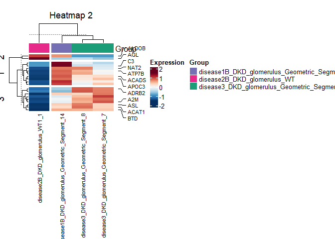
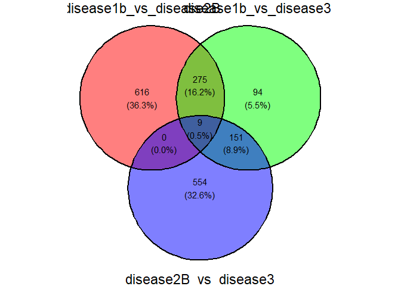
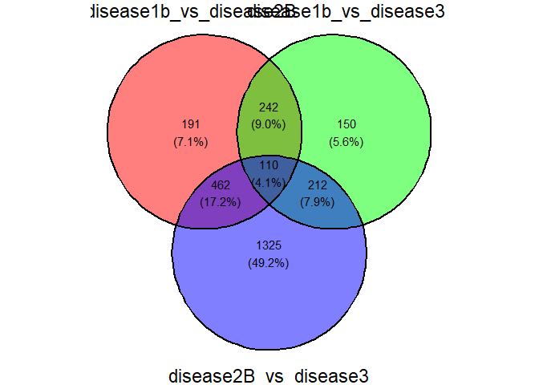
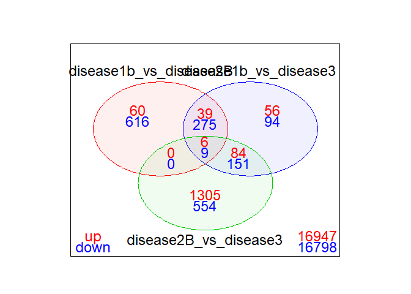
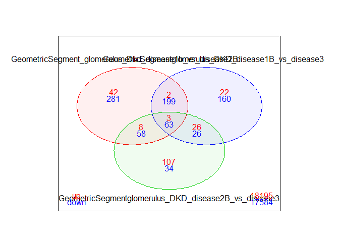

Lancelle, Leonie

<!-- README.md is generated from README.Rmd. Please edit that file -->

# DgeaHeatmap

<!-- badges: start -->

<!-- badges: end -->

The goal of DgeaHeatmap is to enable R users to generate heatmaps more
easily and to assist with preprocessing of read counts. Furthermore, the
package is aimed at simplifying the extraction of raw read counts from
.dcc and .pkc files generated by Nanostring GeoMx DSP.

## Installation

You can install the development version of DgeaHeatmap from
[GitLab](https://gitlab.com/) with:

``` r
devtools::install_gitlab("spittaulab/Dgea_Heatmap_Package", host = "gitlab.ub.uni-bielefeld.de")
```

## Usage

<figure>

<figcaption aria-hidden="true">Step-by-step workflow of a data analysis
using either Read Counts or raw Nanostring GeoMx DSP data files. (A)
Description of the steps starting with Read Counts using functions from
the package DgeaHeatmap. (B) The raw files generated through Nanostring
GeoMx DSP are loaded, preprocessed, and filtered in order to then
extract the Read Counts of all evaluated genes and to perform a
differential gene expression analysis. (C) Using prepared data, the
depicted functions can be utilized to visualize the data distribution
and to choose the fitting number of clusters for the dataset. Heatmaps
can be genereated as wished, showing no annotation, automatically
generated annotation, or specifically chosen annotation.</figcaption>
</figure>

### Building Heatmaps

**This is a basic example that shows you how to solve a common
problem:** The data used in this sample is available through the
NanoString Website and is based on a GeoMx kidney dataset:
<http://nanostring-public-share.s3-website-us-west-2.amazonaws.com/GeoScriptHub/Kidney_Dataset_for_GeomxTools.zip>.

Reeves J, Divakar P, Ortogero N, Griswold M, Yang Z, Zimmerman S,
Vitancol R, Henderson D (2021) Analyzing GeoMx-NGS RNA Expression Data
with GeomxTools. Available from:
<http://bioconductor.riken.jp/packages/3.15/workflows/vignettes/GeoMxWorkflows/inst/doc/GeomxTools_RNA-NGS_Analysis.html>.

    #> Warning: package 'testthat' was built under R version 4.4.3

``` r
library(DgeaHeatmap)
x <- 1
matrixCounts <- build_matrix(input_data, x)
```

|  | No_Template_Control_NA_NA_NA_NA | disease3_DKD_glomerulus_Geometric_Segment_7 | disease3_DKD_glomerulus_Geometric_Segment_8 | disease4_DKD_tubule_PanCK_1 |
|:---|---:|---:|---:|---:|
| A2M | 0 | 1183.26647 | 983.54729 | 87.92538 |
| NAT2 | 0 | 36.59587 | 67.57195 | 74.04243 |
| ACADM | 0 | 75.63146 | 56.30996 | 92.55303 |
| ACADS | 0 | 65.87257 | 63.81795 | 106.43599 |
| ACAT1 | 0 | 70.75202 | 90.09594 | 236.01024 |
| ACVRL1 | 0 | 126.86568 | 82.58794 | 64.78712 |

``` r
parameter1 = "DKD"
parameter2 = "glomerulus"
factors_for_individual_matrix = list(parameter1, parameter2)
indiMatrix <- individual_matrix(factors_for_individual_matrix, matrixCounts)
```

|  | disease3_DKD_glomerulus_Geometric_Segment_7 | disease3_DKD_glomerulus_Geometric_Segment_8 | disease1B_DKD_glomerulus_Geometric_Segment_14 | disease2B_DKD_glomerulus_WT1_1 |
|:---|---:|---:|---:|---:|
| A2M | 1183.26647 | 983.54729 | 684.32136 | 102.5730 |
| NAT2 | 36.59587 | 67.57195 | 68.43214 | 0.0000 |
| ACADM | 75.63146 | 56.30996 | 34.21607 | 0.0000 |
| ACADS | 65.87257 | 63.81795 | 91.24285 | 0.0000 |
| ACAT1 | 70.75202 | 90.09594 | 68.43214 | 0.0000 |
| ACVRL1 | 126.86568 | 82.58794 | 125.45892 | 153.8595 |

**Filtering the matrix for only an x amount of most variably expressed
genes:**

``` r
top_number_of_genes <- 20
varGenesMatrix <- filtering_for_top_exprGenes(indiMatrix, top_number_of_genes)
print(nrow(varGenesMatrix))
#> [1] 20
```

**Using Z-score scaling to scale the values of the matrix:**

``` r
scaled_counts <- scale_counts(varGenesMatrix)
```

**How to visualize the data distribution of the scaled counts:**

``` r
show_data_distribution(scaled_counts)
```


**Generating an elbow plot to choose k for k-mean generation:**

``` r
seed <- 1 # setting a seed for a reproducible outcome
elbow_plot(seed, scaled_counts)
```


This can also be conducted with the transposed matrix to get the number
of clusters the columns can be divided into:

``` r
maxK <- 4                                 # only 4 samples therefore a max of 4 clusters possible
seed <- 1                                 # setting a seed for a reproducible outcome
transposed_matrix <- t(scaled_counts)     # transposes matrix
elbow_plot(seed, transposed_matrix, maxK)
```



As desired, the samples can further be summarized as biological
replicates to help generate more clearly arranged heatmaps and to give a
better overview.

``` r
#print(colnames(scaled_counts))
probes <- list("disease3_DKD_glomerulus_Geometric_Segment", "disease1B_DKD_glomerulus_Geometric_Segment", "disease2B_DKD_glomerulus_WT")
sumBioRepsMatrix <- summarise_bio_replicates(scaled_counts, probes)
```

|  | disease3_DKD_glomerulus_Geometric_Segment | disease1B_DKD_glomerulus_Geometric_Segment | disease2B_DKD_glomerulus_WT |
|:---|---:|---:|---:|
| A2M | 0.7326170 | -0.1149016 | -1.3503324 |
| C3 | -0.2893549 | 1.4431712 | -0.8644613 |
| ALDOB | -0.8564917 | 0.6752631 | 1.0377204 |
| SERPING1 | 0.1467075 | 1.0335593 | -1.3269742 |
| APOE | 0.8517822 | -0.6496811 | -1.0538832 |
| ASS1 | 0.2686383 | 0.8501191 | -1.3873957 |

**Generating K-means for clustering in the heatmap:**

``` r
seed <- 10 #set a seed for reproducibility, but try different seeds first
k_clusters <- 3
K_meanTable <- Kmean_generation(sumBioRepsMatrix, seed, k_clusters)
```

|  | disease3_DKD_glomerulus_Geometric_Segment | disease1B_DKD_glomerulus_Geometric_Segment | disease2B_DKD_glomerulus_WT |  |
|:---|---:|---:|---:|---:|
| ALDOB | -0.8564917 | 0.6752631 | 1.037720 | 1 |
| AGL | -0.4895648 | -0.5154561 | 1.494586 | 1 |
| A2M | 0.7326170 | -0.1149016 | -1.350332 | 2 |
| APOE | 0.8517822 | -0.6496811 | -1.053883 | 2 |
| ASL | 0.5509249 | 0.3669706 | -1.468821 | 2 |
| ACAT1 | 0.5859757 | 0.2818318 | -1.453783 | 2 |

The most variable genes of each cluster are selected using the following
function. A new object is created to save the most variable genes for
each cluster, while the matrix that includes clusters for each gene is
divided into individual cluster matrices. These matrices are then sorted
by their variance.

``` r
number_of_annotations_per_cluster <- 3
k_clusters <- 3
mostVarGeneslist <- most_variable_genes(K_meanTable, number_of_annotations_per_cluster, k_clusters)
```

**To set the annotation for a heatmap the following function can be
used:**

``` r
number_of_annotations_per_cluster <- 3
fontsize_rowAnnotation <- 8
annotation_for_heatmap <- set_annotation(sumBioRepsMatrix, number_of_annotations_per_cluster, fontsize_rowAnnotation)
```

“performing_kMeans” is a function specifically written to perform
k-means clustering outside of the general heatmap function. This allows
for a more reliable splitting of the heatmap by its assigned clusters.

``` r
k_clusters <- 3
split_heatmap_clusters <- performing_kMeans(sumBioRepsMatrix, k_clusters)
```

``` r
colorPalette <- "RdBu"
color_setting(colorPalette)
```

**Finally, a heatmap with clusters can be generated as in this
example:**

``` r
seed <- 1
title <- "Heatmap DKD glomerulus segment"
fontsize_columnNames <-6
fontsize_rowNames <-4
title_heatmap_legend <- "Expression"
WidthNum <- 4.5
HeightNum <- 3
UnitSize <- "cm"
colorPalette <- "RdBu"
hm <- print_heatmap(seed, sumBioRepsMatrix, title, split_heatmap_clusters, annotation_for_heatmap, fontsize_columnNames, fontsize_rowNames, title_heatmap_legend, WidthNum, HeightNum, UnitSize, colorPalette)
```


With “function_complexHeatmap_var”, a heatmap can be created with
automatic annotation of the x most variable genes from each cluster. As
input, a matrix with the scaled counts of the most variable genes from a
dataset can be used. The function is able to summarize biological
replicates.

``` r
title <- "Heatmap DKD glomerulus segment"
fontsize_columnNames <-6
fontsize_rowNames <-4
title_heatmap_legend <- "Expression"
WidthNum <- 4.5
HeightNum <- 3
UnitSize <- "cm"
colorPalette <- "RdBu"

hm <- function_complexHeatmap_var(scaled_counts, probes, number_of_annotations_per_cluster, k_clusters, seed, title, fontsize_rowAnnotation, fontsize_columnNames, fontsize_rowNames, title_heatmap_legend, WidthNum, HeightNum, UnitSize, colorPalette)
```


**A heatmap can further be generated with annotation of specific genes,
as in this example:**

``` r
probes <- list("disease3_DKD_glomerulus_Geometric_Segment", "disease1B_DKD_glomerulus_Geometric_Segment", "disease2B_DKD_glomerulus_WT")
sumBioRepsMatrix <- summarise_bio_replicates(scaled_counts, probes)

seed <- 1
k_clusters <- 3
K_meanTable <- Kmean_generation(sumBioRepsMatrix, seed, k_clusters)

anno_specific_genes <- list("C3", "ALDOB", "ACADS", "APOE")
annotation_for_heatmap <- set_annotation(sumBioRepsMatrix, anno_specific_genes, fontsize_rowAnnotation)
split_heatmap_clusters <- performing_kMeans(sumBioRepsMatrix, k_clusters)

title <- "Heatmap with specific annotation"
k_clusters <- 2
fontsize_columnNames <-6
fontsize_rowNames <-4
title_heatmap_legend <- "Expression"
WidthNum <- 4.5
HeightNum <- 3
UnitSize <- "cm"
colorPalette <- "RdBu"
hm <- print_heatmap(seed, sumBioRepsMatrix, title, split_heatmap_clusters, annotation_for_heatmap, fontsize_columnNames, fontsize_rowNames, title_heatmap_legend, WidthNum, HeightNum, UnitSize, colorPalette)
```


**Generate heatmaps with advanced customization:**

With the function “adv_Heatmap” users can generate heatmaps using a lot
of different settings. The options include:

- changeable heatmap title
- changeable seed for clustering and reproducibility
- changeable color palettes in the heatmap
- choice between the cluster methods: hierarchical and k-means
- choice between distancing methods for hierarchical clustering
  (e.g. euclidean, correlation)
- optional clustering of rows
- optional clustering of columns
- optional splitting of rows through k-means
- optional splitting of columns through k-means
- optional annotation of the columns based on an input metadata file
- changeable color schemes for the column annotation
- changeable side of the column annotation
- optional display of row names
- optional display of column names
- optional annotation of some row names: either automatic through
  choosing the most variable rows or specific using an input list of the
  rownames
- changeable number of automatic row annotations
- changeable font size of the row annotation
- changeable font size of the column names
- changeable font size of the row names
- changeable title of the heatmap legend
- changeable width size of the heatmap
- changeable height size of the heatmap
- changeable unit used for the heatmap sizes

The advanced heatmap can then be generated usind adv_Heatmap() and
choosing parameter options by specifically setting them or alternatively
use the parameters default. The only input necessary to directly
generate a heatmap is the input matrix as shown below.

``` r
# default settings of the parameters
ncounts_matrix <- scaled_counts                       # input matrix
seed <- 1                                             # sets seed, default = 1
column_name <- "Heatmap"                              # name for heatmap, default = "Heatmap"
colorPalette <- NULL                                  # available color palettes from RColorBrewer (), default = NULL
cluster_method <- "hierarchical"                      # cluster methods, either "hierarchical" or "kmeans", default = "hierarchical"
distance_method <- "euclidean"                        # method for creating the distance matrix for hierarchical clustering, default = "euclidean"
cluster_rows <- TRUE                                  # optional clustering of rows, default = TRUE
cluster_columns <- FALSE                              # optional clustering of columns, default = FALSE
k_row = NULL                                          # splitting of rows in heatmaps using k-means, would be an integer, default = NULL
k_col = NULL                                          # splitting of columns in heatmaps using k-means, would be an integer, default = NULL
sample_metadata <- NULL                               # dataframe containing the metadata information of the file, default = NULL
annotation_colors <- NULL                             # list containing the column groups and the choosen colors for the column annotation per group, default = NULL
annotation_name_side = "right"                        # optional change: side of annotation name, default = "right"
show_row_names <- FALSE                               # optional change: show of rownames on = TRUE & off = FALSE, default = FALSE
show_column_names = TRUE                              # optional change: show of column names on = TRUE & off = FALSE, default = TRUE
row_annotation = FALSE                                # optional row annotation, default = FALSE
row_annotation_method = "auto"                        # set if row_annotation = TRUE: options are "auto" & "specific", default = "auto"
row_anno_names = NULL                                 # set if row_annotation = TRUE & row_annotation_method = "specific: input list of specific genes for the row annotation, default = NULL
row_anno_number = 5                                   # optional change: number of automatic row annotations per cluster, default = 5
fontsize_title = 15                                   # optional change: fontsize the heatmap title, default = 15
fontsize_rowAnnotation = 8                            # optional change: fontsize of the optional row annotation, default = 8
fontsize_columnNames = 6                              # optional change: fontsize of the optional column names, default = 6
fontsize_rowNames = 4                                 # optional change: fontsize of the optional row names, default = 4
fontsize_cluster_labels = 8                           # optional change: fontsize of the cluster labels, default = 8
fontsize_group_annotation = 8                         # optional change: font size of the group annotation title, default = 8.
fontsize_group_annotation_legend = 10                 # optional change: fontsize of optional group annotation legend title, default = 10
fontsize_group_annotation_labels = 8                  # optional change: fontsize of optional group annotation legend labels, default = 8
fontsize_heatmap_legend = 8                           # optional change: fontsize of heatmap legend, default = 10
fontsize_heatmap_legend_labels = 8                    # optional change: fontsize of heatmap legend labels, default = 8
title_heatmapLegend = "Expression"                    # changeable title of the legend, default "Expression"
WidthNum = 4.5                                        # optional change of heatmap width, default = 4.5
HeightNum = 3                                         # optional change of heatmap height, default = 3
UnitSize = "cm"                                       # optional change of heatmap unit for sizes, default = "cm"

# Using the adv_Heatmap() function with only the input matrix file. All other parameters use their default option.
hm <- adv_Heatmap(scaled_counts)
```



All the optional parameters can then be changed to the taste and
specifications of the user. For example, the color scheme can be
changed, the row names can be shown in the heatmap and a group
annotation can be pictured using a metadata file as input.

This metadata file can either be loaded into R as an excel or csv file,
or alternatively be produced within R as shown below.

``` r
# set a list of the groups (names should be contained within the sample names)
groups <- c("3_DKD_glomerulus_Geometric_S", "1B_DKD_glomerulus_Geometric_S", "2B_DKD_glomerulus_WT")

# get the sample names from the used data set
sample_names <- c(colnames(scaled_counts))

# Match each sample name to the correct group
group_assignment <- sapply(sample_names, function(sample) {
  matched <- groups[sapply(groups, function(g) grepl(g, sample))]
  if (length(matched) > 0) matched[1] else NA
})

# Ensure same length
stopifnot(length(sample_names) == length(group_assignment))

# Create a dataframe with the sample names and their respective group assignments
sample_metadata <- data.frame(Group = group_assignment, row.names = sample_names)

# confirm matrix column names match the metadata rownames
all(colnames(scaled_counts) == rownames(sample_metadata)) 
#> [1] TRUE

# set a list with the Groups and choose colors for them
group_colors <- list(Group = c("3_DKD_glomerulus_Geometric_S" = "#1b9e77", "1B_DKD_glomerulus_Geometric_S" = "#7570b3", "2B_DKD_glomerulus_WT" = "#e7298a"))

names(group_colors$Group)
#> [1] "3_DKD_glomerulus_Geometric_S"  "1B_DKD_glomerulus_Geometric_S"
#> [3] "2B_DKD_glomerulus_WT"
print(sample_metadata)
#>                                                                       Group
#> disease3_DKD_glomerulus_Geometric_Segment_7    3_DKD_glomerulus_Geometric_S
#> disease3_DKD_glomerulus_Geometric_Segment_8    3_DKD_glomerulus_Geometric_S
#> disease1B_DKD_glomerulus_Geometric_Segment_14 1B_DKD_glomerulus_Geometric_S
#> disease2B_DKD_glomerulus_WT1_1                         2B_DKD_glomerulus_WT
```

The heatmap parameters can then be changed to generate a more advanced
and custom heatmap:

``` r
# parameters and their options in adv_Heatmap()
ncounts_matrix <- scaled_counts                       # input matrix
seed <- 1                                             # sets seed, default = 1
column_name <- "Heatmap 1"                              # name for heatmap, default = "Heatmap"
colorPalette <- "RdBu"                                # available color palettes from RColorBrewer (), default = NULL
cluster_method <- "hierarchical"                      # cluster methods, either "hierarchical" or "kmeans", default = "hierarchical"
distance_method <- "euclidean"                        # method for creating the distance matrix for hierarchical clustering, default = "euclidean"
cluster_rows <- TRUE                                  # optional clustering of rows, default = TRUE
cluster_columns <- FALSE                              # optional clustering of columns, default = FALSE
k_row = NULL                                          # splitting of rows in heatmaps using k-means, would be an integer, default = NULL
k_col = NULL                                          # splitting of columns in heatmaps using k-means, would be an integer, default = NULL
sample_metadata <- sample_metadata                               # dataframe containing the metadata information of the file, default = NULL
annotation_colors <- group_colors                     # list containing the column groups and the choosen colors for the column annotation per group, default = NULL
annotation_name_side = "right"                        # optional change: side of annotation name, default = "right"
show_row_names <- TRUE                               # optional change: show of rownames on = TRUE & off = FALSE, default = FALSE
show_column_names = TRUE                              # optional change: show of column names on = TRUE & off = FALSE, default = TRUE
row_annotation = FALSE                                # optional row annotation, default = FALSE
row_annotation_method = "auto"                        # set if row_annotation = TRUE: options are "auto" & "specific", default = "auto"
row_anno_names = NULL                                 # set if row_annotation = TRUE & row_annotation_method = "specific: input list of specific genes for the row annotation, default = NULL
row_anno_number = 5                                   # optional change: number of automatic row annotations per cluster, default = 5
fontsize_title = 15                                   # optional change: fontsize the heatmap title, default = 15
fontsize_rowAnnotation = 8                            # optional change: fontsize of the optional row annotation, default = 8
fontsize_columnNames = 6                              # optional change: fontsize of the optional column names, default = 6
fontsize_rowNames = 4                                 # optional change: fontsize of the optional row names, default = 4
fontsize_cluster_labels = 8                           # optional change: fontsize of the cluster labels, default = 8
fontsize_group_annotation = 9                         # optional change: font size of the group annotation title, default = 8.
fontsize_group_annotation_legend = 9                 # optional change: fontsize of optional group annotation legend title, default = 10
fontsize_group_annotation_labels = 8                  # optional change: fontsize of optional group annotation legend labels, default = 8
fontsize_heatmap_legend = 9                           # optional change: fontsize of heatmap legend, default = 10
fontsize_heatmap_legend_labels = 8                    # optional change: fontsize of heatmap legend labels, default = 8
title_heatmapLegend = "Expression"                    # changeable title of the legend, default "Expression"
WidthNum = 4.5                                        # optional change of heatmap width, default = 4.5
HeightNum = 3                                         # optional change of heatmap height, default = 3
UnitSize = "cm"                                       # optional change of heatmap unit for sizes, default = "cm"

hm <- adv_Heatmap(ncounts_matrix, seed = seed, column_name = column_name, colorPalette = colorPalette, cluster_method = cluster_method, cluster_rows = cluster_rows, cluster_columns = cluster_columns, k_row = k_row, k_col = k_col, sample_metadata = sample_metadata, annotation_colors = annotation_colors, annotation_name_side = annotation_name_side, show_row_names = show_row_names, show_column_names = show_column_names, row_annotation = row_annotation, row_annotation_method = row_annotation_method, row_anno_names = row_anno_names ,row_anno_number = row_anno_number, fontsize_title = fontsize_title, fontsize_rowAnnotation = fontsize_rowAnnotation, fontsize_columnNames = fontsize_columnNames, fontsize_rowNames = fontsize_rowNames, fontsize_cluster_labels = fontsize_cluster_labels, fontsize_group_annotation = fontsize_group_annotation, fontsize_group_annotation_legend = fontsize_group_annotation_legend, fontsize_group_annotation_labels = fontsize_group_annotation_labels, fontsize_heatmap_legend = fontsize_heatmap_legend, fontsize_heatmap_legend_labels = fontsize_heatmap_legend_labels, title_heatmapLegend = title_heatmapLegend, WidthNum = WidthNum, HeightNum = HeightNum, UnitSize = UnitSize)
```



Alternatively all these options can also be conducted using k-means
Clustering:

``` r
# parameters and their options in adv_heatmap()

ncounts_matrix <- scaled_counts                       # input matrix
seed <- 1                                             # sets seed, default = 1
column_name <- "Heatmap 2"                              # name for heatmap, default = "Heatmap"
colorPalette <- "RdBu"                                # available color palettes from RColorBrewer (), default = NULL
cluster_method <- "kmeans"                      # cluster methods, either "hierarchical" or "kmeans", default = "hierarchical"
distance_method <- "euclidean"                        # method for creating the distance matrix for hierarchical clustering, default = "euclidean"
cluster_rows <- TRUE                                  # optional clustering of rows, default = TRUE
cluster_columns <- TRUE                              # optional clustering of columns, default = FALSE
k_row = 3                                          # splitting of rows in heatmaps using k-means, would be an integer, default = NULL
k_col = 2                                          # splitting of columns in heatmaps using k-means, would be an integer, default = NULL
sample_metadata <- sample_metadata                               # dataframe containing the metadata information of the file, default = NULL
annotation_colors <- group_colors                     # list containing the column groups and the choosen colors for the column annotation per group, default = NULL
annotation_name_side = "right"                        # optional change: side of annotation name, default = "right"
show_row_names <- FALSE                               # optional change: show of rownames on = TRUE & off = FALSE, default = FALSE
show_column_names = FALSE                              # optional change: show of column names on = TRUE & off = FALSE, default = TRUE
row_annotation = TRUE                                # optional row annotation, default = FALSE
row_annotation_method = "auto"                        # set if row_annotation = TRUE: options are "auto" & "specific", default = "auto"
row_anno_names = NULL                                 # set if row_annotation = TRUE & row_annotation_method = "specific: input list of specific genes for the row annotation, default = NULL
row_anno_number = 5                                   # optional change: number of automatic row annotations per cluster, default = 5
fontsize_title = 15                                   # optional change: fontsize the heatmap title, default = 15
fontsize_rowAnnotation = 8                            # optional change: fontsize of the optional row annotation, default = 8
fontsize_columnNames = 6                              # optional change: fontsize of the optional column names, default = 6
fontsize_rowNames = 4                                 # optional change: fontsize of the optional row names, default = 4
fontsize_cluster_labels = 12                           # optional change: fontsize of the cluster labels, default = 8
fontsize_group_annotation = 10                         # optional change: font size of the group annotation title, default = 8.
fontsize_group_annotation_legend = 10                 # optional change: fontsize of optional group annotation legend title, default = 10
fontsize_group_annotation_labels = 8                  # optional change: fontsize of optional group annotation legend labels, default = 8
fontsize_heatmap_legend = 10                           # optional change: fontsize of heatmap legend, default = 10
fontsize_heatmap_legend_labels = 8                    # optional change: fontsize of heatmap legend labels, default = 8
title_heatmapLegend = "Expression"                    # changeable title of the legend, default "Expression"
WidthNum = 5                                        # optional change of heatmap width, default = 4.5
HeightNum = 7                                         # optional change of heatmap height, default = 3
UnitSize = "cm"                                       # optional change of heatmap unit for sizes, default = "cm"

hm <- adv_Heatmap(ncounts_matrix, seed = seed, column_name = column_name, colorPalette = colorPalette, cluster_method = cluster_method, cluster_rows = cluster_rows, cluster_columns = cluster_columns, k_row = k_row, k_col = k_col, sample_metadata = sample_metadata, annotation_colors = annotation_colors, annotation_name_side = annotation_name_side, show_row_names = show_row_names, show_column_names = show_column_names, row_annotation = row_annotation, row_annotation_method = row_annotation_method, row_anno_names = row_anno_names ,row_anno_number = row_anno_number, fontsize_title = fontsize_title, fontsize_rowAnnotation = fontsize_rowAnnotation, fontsize_columnNames = fontsize_columnNames, fontsize_rowNames = fontsize_rowNames, fontsize_cluster_labels = fontsize_cluster_labels, fontsize_group_annotation = fontsize_group_annotation, fontsize_group_annotation_legend = fontsize_group_annotation_legend, fontsize_group_annotation_labels = fontsize_group_annotation_labels, fontsize_heatmap_legend = fontsize_heatmap_legend, fontsize_heatmap_legend_labels = fontsize_heatmap_legend_labels, title_heatmapLegend = title_heatmapLegend, WidthNum = WidthNum, HeightNum = HeightNum, UnitSize = UnitSize)
```



### Differential Gene Expression Analysis Using Nanostring Data

**Functions to analyze Nanostring GeoMx DSP data:**

The raw Nanostring GeoMx DSP files are read in and then united into an
instance of class “NanostringGeoMxSet”.

``` r
rawDataObject <- suppressWarnings(readNanoStringGeoMxSet(dccFiles = DCCFiles,
                                          pkcFiles = PKCFiles,
                                          phenoDataFile = SampleAnnotationFile,
                                          phenoDataSheet = "Template",
                                          phenoDataDccColName = "Sample_ID",
                                          protocolDataColNames = c("aoi","roi"),
                                          configFile = NULL,
                                          analyte = "RNA",
                                          phenoDataColPrefix = "",
                                          experimentDataColNames = NULL))
```

Anon Analyzing GeoMx-NGS RNA Expression Data with GeomxTools. Available
from:
<http://bioconductor.riken.jp/packages/3.15/workflows/vignettes/GeoMxWorkflows/>
inst/doc/GeomxTools_RNA-NGS_Analysis.html (September 21, 2023b). Anon
Developer Introduction to the NanoStringGeoMxSet. Available from:
<https://www.bioconductor.org/packages/devel/bioc/vignettes/GeomxTools/inst/doc>
/Developer_Introduction_to_the_NanoStringGeoMxSet.html (September 21,
2023c).

To preprocess the data, the logarithm of the count matrix is computed
and added to the demoData object. Furthermore, the data is summarized by
splitting it by a chosen column and calculating the mean.

``` r
PrePro_rawDataObject <- add_demoElem(rawDataObject)

class(PrePro_rawDataObject)
#loop over the features(1) or samples(2) of the assayData element and get the mean
assayDataApply(PrePro_rawDataObject, MARGIN=1, FUN=mean, elt="demoElem")[1:5]

#split the data by group column with feature, pheno or protrocol data then get the mean
VGroup <- "aoi"
elt <- "demoElem"
PrePro_rawDataObject <- split_data_by_column(PrePro_rawDataObject, VGroup, elt)

# Quality Control
QCPassed <- aExprsDataQC(PrePro_rawDataObject, "QCFlags")

df_Exp <- genRawReadCountTable(PrePro_rawDataObject)
```

|  | DSP-1001250007851-H-A01.dcc | DSP-1001250007851-H-A02.dcc | DSP-1001250007851-H-A03.dcc | DSP-1001250007851-H-A04.dcc | DSP-1001250007851-H-A05.dcc | DSP-1001250007851-H-A06.dcc | DSP-1001250007851-H-A07.dcc | DSP-1001250007851-H-A08.dcc | DSP-1001250007851-H-A09.dcc |
|:---|---:|---:|---:|---:|---:|---:|---:|---:|---:|
| A2M | 0 | 485 | 262 | 225 | 312 | 563 | 214 | 432 | 176 |
| NAT2 | 0 | 15 | 18 | 5 | 19 | 26 | 9 | 18 | 13 |
| ACADM | 0 | 31 | 15 | 15 | 25 | 31 | 18 | 32 | 14 |
| ACADS | 0 | 27 | 17 | 24 | 19 | 43 | 15 | 26 | 13 |
| ACAT1 | 0 | 29 | 24 | 21 | 17 | 46 | 12 | 32 | 20 |
| ACVRL1 | 0 | 52 | 22 | 24 | 26 | 51 | 18 | 44 | 15 |

Anon Analyzing GeoMx-NGS RNA Expression Data with GeomxTools. Available
from:
<http://bioconductor.riken.jp/packages/3.15/workflows/vignettes/GeoMxWorkflows/>
inst/doc/GeomxTools_RNA-NGS_Analysis.html (September 21, 2023b). Anon
Developer Introduction to the NanoStringGeoMxSet. Available from:
<https://www.bioconductor.org/packages/devel/bioc/vignettes/GeomxTools/inst/doc>
/Developer_Introduction_to_the_NanoStringGeoMxSet.html (September 21,
2023c).

Next, an usable matrix of column data is extracted from the sample data:

``` r
annotation_matrix <- sData(rawDataObject)

annotation_matrix$Samplename <- paste(annotation_matrix$slide_name, annotation_matrix$class, annotation_matrix$region, annotation_matrix$segment, annotation_matrix$roi, sep="_")
class(annotation_matrix)
library(tibble)

annotation_matrix <- tibble::rownames_to_column(annotation_matrix, "Samplenummern")

rownames(annotation_matrix)

annotation_matrix1 <- data.frame(annotation_matrix$Samplenummern, annotation_matrix$Samplename)

coldata_2 <- data.frame(annotation_matrix$Samplename, annotation_matrix$slide_name, annotation_matrix$class, annotation_matrix$region, annotation_matrix$segment, annotation_matrix$roi, annotation_matrix$Samplenummern)

# Renaming the columns
names(coldata_2)[names(coldata_2) == "annotation_matrix.Samplename"] <- "Samplename"
names(coldata_2)[names(coldata_2) == "annotation_matrix.slide_name"] <- "slide_name"
names(coldata_2)[names(coldata_2) == "annotation_matrix.class"] <- "class"
names(coldata_2)[names(coldata_2) == "annotation_matrix.segment"] <- "segment"
names(coldata_2)[names(coldata_2) == "annotation_matrix.sample"] <- "sample"
names(coldata_2)[names(coldata_2) == "annotation_matrix.region"] <- "region"
names(coldata_2)[names(coldata_2) == "annotation_matrix.Samplenummern"] <- "Samplenummern"

coldata_2$Samplename <- gsub(" ", "_", coldata_2$Samplename)

list_rownames <- as.list(coldata_2[,1])

# Combines sample describing columns into one
coldata_2$comp <- paste(coldata_2$segment, coldata_2$region, coldata_2$class, coldata_2$slide_name, sep = "_")

annotationMatrix <- data.frame(coldata_2$Samplenummern, coldata_2$Samplename) 

coldata_2 <- coldata_2[,-1]
coldata_2 <- as.matrix(coldata_2)

list_rownames <- gsub("\\.", "_", list_rownames)
uniq_rownames <- make.names(list_rownames, unique = TRUE) # makes all names in the list_rownames unique to later use them as rownames
print(uniq_rownames)
uniq_rownames <- gsub("\\.", "_", uniq_rownames)

rownames(coldata_2) <- uniq_rownames

# Creates a new dataframe wich only includes the necessary information
coldata_df <- as.data.frame(coldata_2)
class(coldata_df)

# exchange of "." with "_" in the rownames of the column data
rownames(coldata_2) <- gsub("\\.", "_", rownames(coldata_2))
```

The columns in the counts table can now be replaced with the
corresponding sample names from the table containing the column data. To
do this, the following code can be used:

``` r
list_columnNames <- as.list(colnames(df_Exp)) # list of column names in counts table

list_rownames <- as.list(annotationMatrix[,2])

annotationMatrix <- as.matrix(annotationMatrix)
rownames(annotationMatrix) <- list_rownames
x <- match(rownames(annotationMatrix), colnames(df_Exp))
print(x)
copy_df_Expr <- df_Exp # creates copy of counts table

annotationMatrix <- as.data.frame(annotationMatrix)

for (i in list_columnNames) {
  matchingRow <- which(annotationMatrix$coldata_2.Samplenummern == i)
  matchingColumn <- match(i, names(copy_df_Expr))
  print(matchingColumn)
  print(matchingRow)
  colnames(copy_df_Expr)[matchingColumn] <- rownames(annotationMatrix)[matchingRow]
  print(rownames(annotationMatrix)[matchingRow])
}

# exchange of "." with "_" in the column names of copy_df_Expr
colnames(copy_df_Expr) <- gsub("\\.", "_", colnames(copy_df_Expr))
```

|  | No_Template_Control_NA_NA_NA_NA | disease3_DKD_glomerulus_Geometric_Segment_7 | disease3_DKD_glomerulus_Geometric_Segment_8 | disease3_DKD_glomerulus_Geometric_Segment_9 | disease3_DKD_glomerulus_Geometric_Segment_10 | disease3_DKD_glomerulus_Geometric_Segment_11 | disease3_DKD_glomerulus_Geometric_Segment_12 | disease3_DKD_glomerulus_Geometric_Segment_13 | disease3_DKD_glomerulus_Geometric_Segment_14 |
|:---|---:|---:|---:|---:|---:|---:|---:|---:|---:|
| A2M | 0 | 485 | 262 | 225 | 312 | 563 | 214 | 432 | 176 |
| NAT2 | 0 | 15 | 18 | 5 | 19 | 26 | 9 | 18 | 13 |
| ACADM | 0 | 31 | 15 | 15 | 25 | 31 | 18 | 32 | 14 |
| ACADS | 0 | 27 | 17 | 24 | 19 | 43 | 15 | 26 | 13 |
| ACAT1 | 0 | 29 | 24 | 21 | 17 | 46 | 12 | 32 | 20 |
| ACVRL1 | 0 | 52 | 22 | 24 | 26 | 51 | 18 | 44 | 15 |

**Differential gene expression analysis**

The process of performing a differential gene expression analysis starts
by checking whether all the columns of the raw data are present in the
metadata and if the column names appear in the same order in both the
raw data and metadata.

``` r
all(colnames(copy_df_Expr) %in% rownames(coldata_2)) #check if all column names of data are in rownames of metadata #check if TRUE
#> [1] TRUE
class(coldata_2)
#> [1] "matrix" "array"

all(colnames(copy_df_Expr) == rownames(coldata_2)) #check if the order of the data column names == order of metadata rownames
#> [1] TRUE
```

Love M, Ahlmann-Eltze C, Forbes K, Anders S, Huber W, FP7 RE, NHGRI N,
CZI (2023) DESeq2: Differential gene expression analysis based on the
negative binomial distribution.
<https://doi.org/10.18129/B9.bioc.DESeq2>

The differential gene expression analysis can be conducted based on
limma voom, DESeq2, and edgeR.

**DEA Limma**

Utilizing limma voom, a matrix is created in which each coefficient
represents the average of the samples from one group. Afterwards, the
contrasts are set to direct testing between chosen groups in the
analysis. To scale the raw library sizes, the normalization factors are
calculated. The count data is then transformed to log2-counts per
million, and the mean-variance relationship is estimated. By fitting a
linear model to each gene, both fold changes and standard errors are
estimated. The fitted model objects are then reorientated from the
coefficients of the design matrix to any set of contrasts of the
original coefficients. The standard errors are smoothed by empirical
Bayes. Finally, the results of the differential gene expression analysis
are classified as up, down, or not significantly differently expressed.

``` r
coldata2 <- as.data.frame((coldata_2))

comparisons <- list(
  "GeometricSegment_glomerulus_Dkd_disease1b_vs_disease2B" = c("Geometric_Segment_glomerulus_DKD_disease1B ", "Geometric_Segment_glomerulus_DKD_disease2B "),
  "GeometricSegmentglomerulus_DKD_disease1B_vs_disease3" = c("Geometric_Segment_glomerulus_DKD_disease1B ", "Geometric_Segment_glomerulus_DKD_disease3"),
  "GeometricSegmentglomerulus_DKD_disease2B_vs_disease3" = c("Geometric_Segment_glomerulus_DKD_disease2B ", "Geometric_Segment_glomerulus_DKD_disease3")
)

groupingColumns <- c("segment", "region", "class", "slide_name")
DGEA_results <- DGEALimma(copy_df_Expr, coldata2, grouping_columns = groupingColumns, comparisons = comparisons)

results_all_DEG <- decideTests(DGEA_results$fit)
#> Error in decideTests(DGEA_results$fit): could not find function "decideTests"
summary(results_all_DEG)
#> Error in h(simpleError(msg, call)): error in evaluating the argument 'object' in selecting a method for function 'summary': object 'results_all_DEG' not found

result1 = topTable(fit2, coef= "GeometricSegment_glomerulus_Dkd_disease1b_vs_disease2B", number = Inf, adjust.method = "fdr") %>%
  as.data.frame() # differentially expressed genes are obtained by topTreat() function
#> Error in h(simpleError(msg, call)): error in evaluating the argument 'x' in selecting a method for function 'as.data.frame': could not find function "topTable"

# filter results to get significantly differentially expressed genes
topUp <- result1[which(result1$logFC > 0),] [1:100,] # up reg top 100
#> Error: object 'result1' not found
topDown <- result1[which(result1$logFC < 0),] [1:100,] # down reg top 100
#> Error: object 'result1' not found

class(topUp)
#> Error: object 'topUp' not found

NamesUpReg <- row.names(topUp)
#> Error: object 'topUp' not found
NamesDownReg <- row.names(topDown)
#> Error: object 'topDown' not found
print(NamesDownReg)
#> Error: object 'NamesDownReg' not found

result1 <- result1 %>%
  dplyr::mutate(isSignificant = case_when(
    adj.P.Val < 0.05& abs(logFC) >1 ~TRUE,
    TRUE ~ FALSE # If condictions in the line above are not met, gene is not DE.
    ))
#> Error: object 'result1' not found

sigDEresults <- result1 %>%
  dplyr::filter(isSignificant == TRUE)
#> Error: object 'result1' not found
```

inesdesantiago (2020) 10 Tips & Tricks for complex model.matrix designs
in DGE analysis. Sequencing QC and data analysis blog. Available from:
Bibliography 96 <a
href="https://seqqc.wordpress.com/2020/11/28/10-tips-tricks-for-complex-model-matrixdesigns-in-dge-analysis/"
class="uri">https://seqqc.wordpress.com/2020/11/28/10-tips-tricks-for-complex-model-matrixdesigns-in-dge-analysis/</a>
(September 21, 2023). Anon Developer Introduction to the
NanoStringGeoMxSet. Available from:
<https://www.bioconductor.org/packages/devel/bioc/vignettes/GeomxTools/inst/doc>
/Developer_Introduction_to_the_NanoStringGeoMxSet.html (September 21,
2023c).

**Visualisation with a Venn Diagramm:**

The results from the differential gene expression analysis are
visualized using a Venn diagramm to represent the up- and down-
regulated genes between groups. This is set up in the following way:

``` r
library(VennDiagram)
#> Loading required package: grid
#> Loading required package: futile.logger
library(limma)
#> 
#> Attaching package: 'limma'
#> The following object is masked from 'package:BiocGenerics':
#> 
#>     plotMA
venn.plot <- vennDiagram(results_all_DEG,
              imagetype = "tiff",
              include=c("up", "down"), mar=rep(1,4), cex=c(1,1,0.7), lwd=1,
              counts.col=c("red", "blue"),
              circle.col = c("red", "blue", "green3"))
#> Error: object 'results_all_DEG' not found
```

Chen, H., Boutros, P.C. VennDiagram: a package for the generation of
highly-customizable Venn and Euler diagrams in R. BMC Bioinformatics 12,
35 (2011). <https://doi.org/10.1186/1471-2105-12-35>

**DEA DESeq2**

The raw counts are first structured into a DESeqDataSEt and comparisons
are used to test specific differences between groups. Next, the size
factors are estimated for normalization and dispersion values are
estimated for each gene. A GLM (generalized linear model) is fit to the
data through negative niomial distribution. A Wald test is performed for
statistical testing and p-values are adjusted for multiple testing
through Benjamin-Hochberg procedure. The data is then classified into up
and down reguated and not significantly expressed genes.

``` r
comparisons <- list(
  "disease1b_vs_disease2B" = c("Geometric_Segment_glomerulus_DKD_disease1B", "Geometric_Segment_glomerulus_DKD_disease2B"),
  "disease1b_vs_disease3"  = c("Geometric_Segment_glomerulus_DKD_disease1B", "Geometric_Segment_glomerulus_DKD_disease3"),
  "disease2B_vs_disease3"  = c("Geometric_Segment_glomerulus_DKD_disease2B", "Geometric_Segment_glomerulus_DKD_disease3")
)
int_counts <- round(copy_df_Expr)
groupingColumns <- c("segment", "region", "class", "slide_name")
results_DESeq2 <- DGEA_DESeq2(int_counts, coldata2, groupingColumns,comparisons)
#> converting counts to integer mode
#> estimating size factors
#> estimating dispersions
#> gene-wise dispersion estimates
#> mean-dispersion relationship
#> -- note: fitType='parametric', but the dispersion trend was not well captured by the
#>    function: y = a/x + b, and a local regression fit was automatically substituted.
#>    specify fitType='local' or 'mean' to avoid this message next time.
#> final dispersion estimates
#> fitting model and testing
#> 1 rows did not converge in beta, labelled in mcols(object)$betaConv. Use larger maxit argument with nbinomWaldTest
#> -- replacing outliers and refitting for 14848 genes
#> -- DESeq argument 'minReplicatesForReplace' = 7 
#> -- original counts are preserved in counts(dds)
#> estimating dispersions
#> fitting model and testing
#> 1 rows did not converge in beta, labelled in mcols(object)$betaConv. Use larger maxit argument with nbinomWaldTest
results_list_d <- results_DESeq2$results
```

Venn Diagram for up regulated genes extracted from the DESeq2 analysis:

``` r
library(ggvenn)
#> Loading required package: dplyr
#> 
#> Attaching package: 'dplyr'
#> The following object is masked from 'package:NanoStringNCTools':
#> 
#>     groups
#> The following objects are masked from 'package:S4Vectors':
#> 
#>     first, intersect, rename, setdiff, setequal, union
#> The following object is masked from 'package:Biobase':
#> 
#>     combine
#> The following objects are masked from 'package:BiocGenerics':
#> 
#>     combine, intersect, setdiff, union
#> The following object is masked from 'package:testthat':
#> 
#>     matches
#> The following objects are masked from 'package:stats':
#> 
#>     filter, lag
#> The following objects are masked from 'package:base':
#> 
#>     intersect, setdiff, setequal, union
up_genes <- extractDEGenes(results_list_d, contrasts, only_up = TRUE)
ggvenn(up_genes, fill_color = c("red", "green", "blue"))
```


Venn Diagram for down regulated genes extracted from the DESeq2
analysis:

``` r
down_genes <- extractDEGenes(results_list_d, contrasts, only_down = TRUE)
ggvenn(down_genes, fill_color = c("red", "green", "blue"))
```


Venn Diagram for significant genes extracted from the DESeq2 analysis:

``` r
sig_genes <- extractDEGenes(results_list_d, contrasts, only_sig = TRUE)
ggvenn(sig_genes, fill_color = c("red", "green", "blue"))
```



Venn Diagram for up and down regulated genes extracted from the DESeq2
analysis:

``` r
state_mat <- extractDEGenes(results_list_d, contrasts, up_down = TRUE)
head(state_mat)
#>        disease1b_vs_disease2B disease1b_vs_disease3 disease2B_vs_disease3
#> A2M                         0                     0                     0
#> NAT2                        0                     0                     0
#> ACADM                      -1                     0                     0
#> ACADS                       0                     0                     0
#> ACAT1                       0                     0                     1
#> ACVRL1                      0                     0                     0
venn.plot <- vennDiagram(state_mat,
                         imagetype = "tiff",
                         include=c("up", "down"), mar=rep(1,4), cex=c(1.5,1,0.7), lwd=1,
                         counts.col=c("red", "blue"),
                         circle.col = c("red", "blue", "green3"))
#> Warning in plot.window(...): "imagetype" is not a graphical parameter
#> Warning in plot.xy(xy, type, ...): "imagetype" is not a graphical parameter
#> Warning in title(...): "imagetype" is not a graphical parameter
```



**DEA edgeR**

The raw counts are first used to construct a DGEList object and grouping
factors are identified. Then genes with low expression are filtered
before the normalization factors are calculated using trimmed mean of
m-values (TMM). A linear model is fitted to each gene and fold changes,
as well as standard errors are estimated. The model is then reorientated
using contrasts (set as comparison) of the original coefficients. The
results of the differential gene expression analysis are classified as
up, down, or not significantly differently expressed.

``` r
comparisons <- list(
  "GeometricSegment_glomerulus_Dkd_disease1b_vs_disease2B" = c("Geometric_Segment_glomerulus_DKD_disease1B ", "Geometric_Segment_glomerulus_DKD_disease2B "),
  "GeometricSegmentglomerulus_DKD_disease1B_vs_disease3" = c("Geometric_Segment_glomerulus_DKD_disease1B ", "Geometric_Segment_glomerulus_DKD_disease3"),
  "GeometricSegmentglomerulus_DKD_disease2B_vs_disease3" = c("Geometric_Segment_glomerulus_DKD_disease2B ", "Geometric_Segment_glomerulus_DKD_disease3")
)
groupingColumns <- c("segment", "region", "class", "slide_name")
results_edgeR <- DGEAedgeR(int_counts, coldata2, groupingColumns, comparisons, prefix = "DEA")

edgeR_summary <- summarize_edgeR_DEA(results_edgeR)
```

Venn Diagram for up and down regulated genes extracted from the edgeR
analysis:

``` r
# Suppose `edgeR_summary` is the output of summarize_edgeR_DEA()
state_matrix <- edgeR_summary$classified_results %>%
  lapply(function(df) df$decision) %>%       # extract the –1/0/+1 vector for each contrast
  do.call(cbind, .)                          # bind into a matrix
colnames(state_matrix) <- names(edgeR_summary$classified_results)

venn.plot <- vennDiagram(state_matrix,
                         imagetype = "tiff",
                         include=c("up", "down"), mar=rep(1,4), cex=c(1,0.8,0.7), lwd=1,
                         counts.col=c("red", "blue"),
                         circle.col = c("red", "blue", "green3"))
```



Normalized Counts can for example be extracted as in this example:

    #> 
    #> Attaching package: 'data.table'
    #> The following objects are masked from 'package:dplyr':
    #> 
    #>     between, first, last
    #> The following objects are masked from 'package:S4Vectors':
    #> 
    #>     first, second
