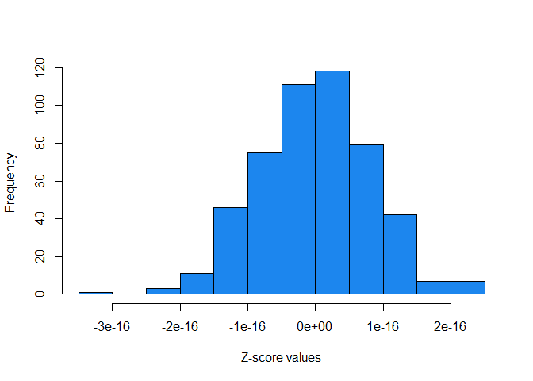
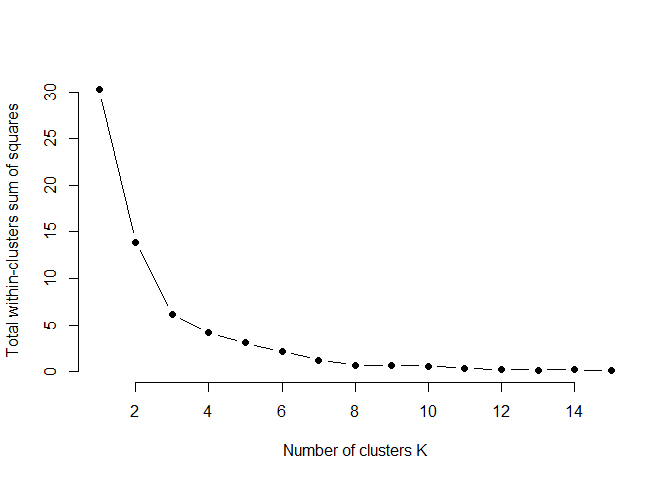
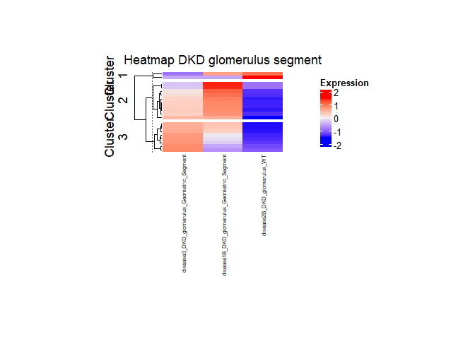
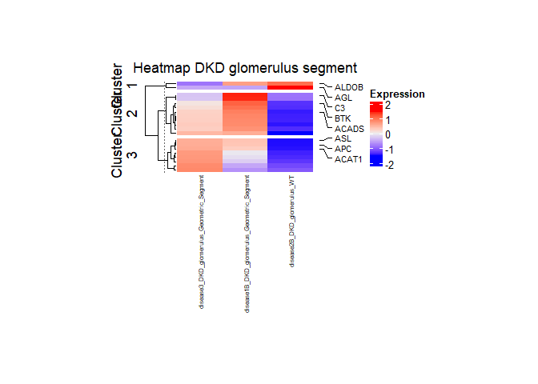
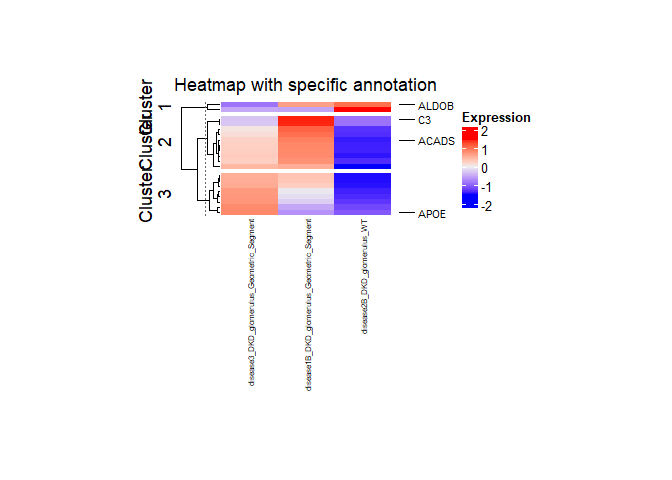
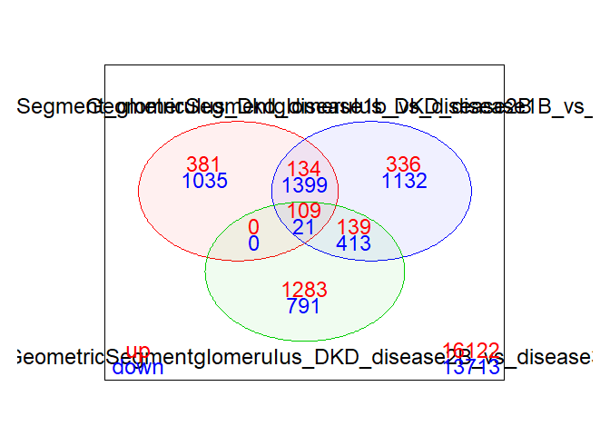

<!-- README.md is generated from README.Rmd. Please edit that file -->

# DgeaHeatmap

<!-- badges: start -->
<!-- badges: end -->

The goal of DgeaHeatmap is to enable R users to generate heatmaps more
easily and to assist with preprocessing of read counts. Furthermore, the
package is aimed at simplifying the extraction of raw read counts from
.dcc and .pkc files generated by Nanostring GeoMx DSP.

## Installation

You can install the development version of DgeaHeatmap from
[GitHub](https://github.com/) with:

``` r
# install.packages("pak")
pak::pak("leolanci/Dgea_Heatmap_Package")
```

## Usage

<figure>

<figcaption aria-hidden="true">Step-by-step workflow of a data analysis
using either Read Counts or raw Nanostring GeoMx DSP data files. (A)
Description of the steps starting with Read Counts using functions from
the package DgeaHeatmap. (B) The raw files generated through Nanostring
GeoMx DSP are loaded, preprocessed, and filtered in order to then
extract the Read Counts of all evaluated genes and to perform a
differential gene expression analysis. (C) Using prepared data, the
depicted functions can be utilized to visualize the data distribution
and to choose the fitting number of clusters for the dataset. Heatmaps
can be genereated as wished, showing no annotation, automatically
generated annotation, or specifically chosen annotation.</figcaption>
</figure>

### Building Heatmaps

**This is a basic example that shows you how to solve a common
problem:**

``` r
library(DgeaHeatmap)
x <- 1
matrixCounts <- build_matrix(input_data, x)
```

|               | P0_cortex_Iba1_pos_1 | P0_cortex_Iba1_pos_2 | P0_cortex_Iba1_pos_3 | P0_cortex_Iba1_neg_1 |
|:--------------|---------------------:|---------------------:|---------------------:|---------------------:|
| Casp6         |                 10.5 |                 7.00 |                  2.8 |                 8.10 |
| Atl3          |                  7.0 |                13.99 |                  8.4 |                12.23 |
| C030006K11Rik |                 10.5 |                 7.00 |                  8.4 |                10.16 |
| Cflar         |                 10.5 |                17.49 |                  5.6 |                 7.22 |
| Aftph         |                  7.0 |                10.50 |                  8.4 |                11.78 |
| Tmem41b       |                  3.5 |                 7.00 |                  8.4 |                 6.63 |

``` r
parameter1 = "cortex"
parameter2 = "pos"
factors_for_individual_matrix = list(parameter1, parameter2)
indiMatrix <- individual_matrix(factors_for_individual_matrix, matrixCounts)
```

|               | P0_cortex_Iba1_pos_1 | P0_cortex_Iba1_pos_2 | P0_cortex_Iba1_pos_3 | P5_cortex_Iba1_pos_1 | P5_cortex_Iba1_pos_2 | P5_cortex_Iba1_pos_3 | P15_cortex_Iba1_pos_1 | P15_cortex_Iba1_pos_2 | P15_cortex_Iba1_pos_3 |
|:--------------|---------------------:|---------------------:|---------------------:|---------------------:|---------------------:|---------------------:|----------------------:|----------------------:|----------------------:|
| Casp6         |                 10.5 |                 7.00 |                  2.8 |                11.20 |                 4.66 |                16.79 |                  4.87 |                  9.80 |                 10.38 |
| Atl3          |                  7.0 |                13.99 |                  8.4 |                13.99 |                 9.33 |                 5.60 |                  8.92 |                 12.60 |                  7.67 |
| C030006K11Rik |                 10.5 |                 7.00 |                  8.4 |                13.99 |                 4.66 |                11.20 |                 10.55 |                 15.39 |                  7.67 |
| Cflar         |                 10.5 |                17.49 |                  5.6 |                13.99 |                18.66 |                 8.40 |                  9.74 |                 11.20 |                  9.03 |
| Aftph         |                  7.0 |                10.50 |                  8.4 |                 2.80 |                 4.66 |                 5.60 |                 16.23 |                  9.80 |                  9.03 |
| Tmem41b       |                  3.5 |                 7.00 |                  8.4 |                 5.60 |                 4.66 |                 5.60 |                  8.92 |                 16.79 |                  4.97 |

**Filtering the matrix for only an x amount of most variably expressed
genes:**

``` r
top_number_of_genes <- 500
varGenesMatrix <- filtering_for_top_exprGenes(indiMatrix, top_number_of_genes)
print(nrow(varGenesMatrix))
#> [1] 500
```

**Using Z-score scaling to scale the values of the matrix:**

``` r
scaled_counts <- scale_counts(varGenesMatrix)
```

**How to visualize the data distribution of the scaled counts:**

``` r
show_data_distribution(scaled_counts)
```


**Generating an elbow plot to choose k for k-mean generation:**

``` r
seed <- 1 # setting a seed for a reproducible outcome
elbow_plot(seed, scaled_counts)
```

 As
desired, the samples can further be summarized as biological replicates
to help generate more clearly arranged heatmaps and to give a better
overview.

``` r
probes <- list("P0_cortex_Iba1_pos", "P5_cortex_Iba1_pos", "P15_cortex_Iba1_pos")
sumBioRepsMatrix <- summarise_bio_replicates(scaled_counts, probes)
```

|         | P0_cortex_Iba1_pos | P5_cortex_Iba1_pos | P15_cortex_Iba1_pos |
|:--------|-------------------:|-------------------:|--------------------:|
| Hba-a1  |          0.2388201 |          0.6255464 |          -0.8643665 |
| Hbb-b1  |          0.1717879 |          0.7083344 |          -0.8801224 |
| Nrgn    |         -0.8124253 |         -0.3790624 |           1.1914877 |
| Gm52800 |          1.0355657 |          0.1047927 |          -1.1403584 |
| Lrr1    |          0.8561965 |         -0.0353765 |          -0.8208200 |
| Tuba1a  |          0.8549090 |          0.1379734 |          -0.9928824 |

**Generating K-means for clustering in the heatmap:**

``` r
seed <- 1 #set a seed for reproducibility, but try different seeds first
k_clusters <- 2
K_meanTable <- Kmean_generation(sumBioRepsMatrix, seed, k_clusters)
```

|         | P0_cortex_Iba1_pos | P5_cortex_Iba1_pos | P15_cortex_Iba1_pos |     |
|:--------|-------------------:|-------------------:|--------------------:|----:|
| Hba-a1  |          0.2388201 |          0.6255464 |          -0.8643665 |   1 |
| Hbb-b1  |          0.1717879 |          0.7083344 |          -0.8801224 |   1 |
| Gm52800 |          1.0355657 |          0.1047927 |          -1.1403584 |   1 |
| Lrr1    |          0.8561965 |         -0.0353765 |          -0.8208200 |   1 |
| Tuba1a  |          0.8549090 |          0.1379734 |          -0.9928824 |   1 |
| Gm52416 |          0.8877816 |          0.1610086 |          -1.0487902 |   1 |

The most variable genes of each cluster are selected using the following
function. A new object is created to save the most variable genes for
each cluster, while the matrix that includes clusters for each gene is
divided into individual cluster matrices. These matrices are then sorted
by their variance.

``` r
number_of_annotations_per_cluster <- 5
k_clusters <- 2
mostVarGeneslist <- most_variable_genes(K_meanTable, number_of_annotations_per_cluster, k_clusters)
print(mostVarGeneslist)
#> [[1]]
#> [1] "Gm40862"
#> 
#> [[2]]
#> [1] "Rps17"
#> 
#> [[3]]
#> [1] "Fabp7"
#> 
#> [[4]]
#> [1] "Gm52432"
#> 
#> [[5]]
#> [1] "Ptma"
#> 
#> [[6]]
#> [1] "Pacsin1"
#> 
#> [[7]]
#> [1] "Clu"
#> 
#> [[8]]
#> [1] "Zfp365"
#> 
#> [[9]]
#> [1] "Diras2"
#> 
#> [[10]]
#> [1] "Purb"
```

**To set the annotation for a heatmap the following function can be
used:**

``` r
number_of_annotations_per_cluster <- 5
annotation_for_heatmap <- set_annotation(sumBioRepsMatrix, number_of_annotations_per_cluster)
```

“performing_kMeans” is a function specifically written to perform
k-means clustering outside of the general heatmap function. This allows
for a more reliable splitting of the heatmap by its assigned clusters.

``` r
k_clusters <- 2
split_heatmap_clusters <- performing_kMeans(sumBioRepsMatrix, k_clusters)
```

``` r
colorPalette <- "RdBu"
color_setting(colorPalette)
#>  [1] "#053061" "#0A3B70" "#10467F" "#16518E" "#1B5C9E" "#2166AC" "#2870B1"
#>  [8] "#2F79B5" "#3682BA" "#3D8BBF" "#4695C4" "#569FC9" "#66A9CF" "#76B3D4"
#> [15] "#86BDDA" "#95C6DF" "#A2CDE2" "#AFD4E6" "#BCDAEA" "#C9E1ED" "#D4E6F0"
#> [22] "#DBEAF2" "#E3EDF3" "#EBF1F4" "#F3F5F6" "#F7F4F2" "#F8EEE8" "#FAE8DE"
#> [29] "#FBE3D4" "#FCDDCA" "#FBD4BE" "#FAC9B0" "#F8BEA2" "#F6B394" "#F4A886"
#> [36] "#EF9B7A" "#E98D6F" "#E37E64" "#DD7059" "#D7624F" "#D05447" "#C84540"
#> [43] "#C13639" "#BA2832" "#B2192B" "#A41328" "#940E26" "#850923" "#760421"
#> [50] "#67001F"
```

**Finally, a heatmap with clusters can be generated as in this
example:**

``` r
seed <- 1
title <- "Heatmap Cortex Iba1 positive"
fontsize_columnNames <-6
fontsize_rowNames <-4
title_heatmap_legend <- "Expression"
WidthNum <- 4.5
HeightNum <- 3
UnitSize <- "cm"
colorPalette <- "RdBu"
hm <- print_heatmap(seed, sumBioRepsMatrix, title, split_heatmap_clusters, annotation_for_heatmap, fontsize_columnNames, fontsize_rowNames, title_heatmap_legend, WidthNum, HeightNum, UnitSize, colorPalette)
```

 With
“function_complexHeatmap_var”, a heatmap can be created with automatic
annotation of the x most variable genes from each cluster. As input, a
matrix with the scaled counts of the most variable genes from a dataset
can be used. The function is able to summarize biological replicates.

``` r
title <- "Heatmap Cortex Iba1 positive"
fontsize_columnNames <-6
fontsize_rowNames <-4
title_heatmap_legend <- "Expression"
WidthNum <- 4.5
HeightNum <- 3
UnitSize <- "cm"
colorPalette <- "RdBu"

hm <- function_complexHeatmap_var(scaled_counts, probes, number_of_annotations_per_cluster, k_clusters, seed, title, fontsize_columnNames, fontsize_rowNames, title_heatmap_legend, WidthNum, HeightNum, UnitSize, colorPalette)
```



**A heatmap can further be generated with annotation of specific genes,
as in this example:**

``` r
probes <- list("P0_cortex_Iba1_pos", "P5_cortex_Iba1_pos", "P15_cortex_Iba1_pos")
sumBioRepsMatrix <- summarise_bio_replicates(scaled_counts, probes)

seed <- 1
k_clusters <- 2
K_meanTable <- Kmean_generation(sumBioRepsMatrix, seed, k_clusters)

anno_specific_genes <- list("Stmn1", "Sox4", "Cldn5", "Mapt", "Camk2a", "Gapdh", "Plp1", "Apoe")
annotation_for_heatmap <- set_annotation(sumBioRepsMatrix, anno_specific_genes)
split_heatmap_clusters <- performing_kMeans(sumBioRepsMatrix, k_clusters)

title <- "Heatmap with specific annotation"
k_clusters <- 2
fontsize_columnNames <-6
fontsize_rowNames <-4
title_heatmap_legend <- "Expression"
WidthNum <- 4.5
HeightNum <- 3
UnitSize <- "cm"
colorPalette <- "RdBu"
hm <- print_heatmap(seed, sumBioRepsMatrix, title, split_heatmap_clusters, annotation_for_heatmap, fontsize_columnNames, fontsize_rowNames, title_heatmap_legend, WidthNum, HeightNum, UnitSize, colorPalette)
```



### Differential Gene Expression Analysis Using Nanostring Data

**Functions to analyze Nanostring GeoMx DSP data:**

The raw Nanostring GeoMx DSP files are read in and then united into an
instance of class “NanostringGeoMxSet”.

``` r
rawDataObject <- suppressWarnings(readNanoStringGeoMxSet(dccFiles = DCCFiles,
                                          pkcFiles = PKCFiles,
                                          phenoDataFile = SampleAnnotationFile,
                                          phenoDataSheet = "Template",
                                          phenoDataDccColName = "Sample_ID",
                                          protocolDataColNames = c("aoi","roi"),
                                          configFile = NULL,
                                          analyte = "RNA",
                                          phenoDataColPrefix = "",
                                          experimentDataColNames = NULL))
```

Anon Analyzing GeoMx-NGS RNA Expression Data with GeomxTools. Available
from:
<http://bioconductor.riken.jp/packages/3.15/workflows/vignettes/GeoMxWorkflows/>
inst/doc/GeomxTools_RNA-NGS_Analysis.html (September 21, 2023b). Anon
Developer Introduction to the NanoStringGeoMxSet. Available from:
<https://www.bioconductor.org/packages/devel/bioc/vignettes/GeomxTools/inst/doc>
/Developer_Introduction_to_the_NanoStringGeoMxSet.html (September 21,
2023c).

To preprocess the data, the logarithm of the count matrix is computed
and added to the demoData object. Furthermore, the data is summarized by
splitting it by a chosen column and calculating the mean.

``` r
PrePro_rawDataObject <- add_demoElem(rawDataObject)

class(PrePro_rawDataObject)
#loop over the features(1) or samples(2) of the assayData element and get the mean
assayDataApply(PrePro_rawDataObject, MARGIN=1, FUN=mean, elt="demoElem")[1:5]

#split the data by group column with feature, pheno or protrocol data then get the mean
VGroup <- "aoi"
elt <- "demoElem"
PrePro_rawDataObject <- split_data_by_column(PrePro_rawDataObject, VGroup, elt)

# Quality Control
QCPassed <- aExprsDataQC(PrePro_rawDataObject, "QCFlags")

df_Exp <- genRawReadCountTable(PrePro_rawDataObject)
```

|               | DSP-1012500008461-B-A02.dcc | DSP-1012500008461-B-A03.dcc | DSP-1012500008461-B-A04.dcc | DSP-1012500008461-B-A05.dcc | DSP-1012500008461-B-A06.dcc | DSP-1012500008461-B-A07.dcc | DSP-1012500008461-B-A08.dcc | DSP-1012500008461-B-A09.dcc | DSP-1012500008461-B-A10.dcc |
|:--------------|----------------------------:|----------------------------:|----------------------------:|----------------------------:|----------------------------:|----------------------------:|----------------------------:|----------------------------:|----------------------------:|
| 0610009B22Rik |                          13 |                          80 |                           5 |                          19 |                           8 |                          27 |                          12 |                         124 |                          11 |
| Sanbr         |                           9 |                          58 |                           3 |                          12 |                           3 |                          42 |                          16 |                          86 |                           4 |
| 0610010K14Rik |                          20 |                         101 |                           9 |                          25 |                           6 |                          58 |                          22 |                         112 |                          10 |
| 0610012G03Rik |                          24 |                         100 |                          12 |                          35 |                          16 |                          91 |                          31 |                         138 |                          11 |
| 0610030E20Rik |                          10 |                          61 |                           9 |                          31 |                           8 |                          25 |                          14 |                         112 |                           3 |
| 0610040J01Rik |                          11 |                          33 |                           4 |                           7 |                           7 |                          22 |                          23 |                         115 |                           6 |

Anon Analyzing GeoMx-NGS RNA Expression Data with GeomxTools. Available
from:
<http://bioconductor.riken.jp/packages/3.15/workflows/vignettes/GeoMxWorkflows/>
inst/doc/GeomxTools_RNA-NGS_Analysis.html (September 21, 2023b). Anon
Developer Introduction to the NanoStringGeoMxSet. Available from:
<https://www.bioconductor.org/packages/devel/bioc/vignettes/GeomxTools/inst/doc>
/Developer_Introduction_to_the_NanoStringGeoMxSet.html (September 21,
2023c).

Next, an usable matrix of column data is extracted from the sample data:

``` r
annotation_matrix <- sData(rawDataObject)

annotation_matrix$Samplename <- paste(annotation_matrix$age_region, annotation_matrix$segment, annotation_matrix$sample, sep="_")
class(annotation_matrix)
library(tibble)

annotation_matrix <- tibble::rownames_to_column(annotation_matrix, "Samplenummern")

rownames(annotation_matrix)

annotation_matrix1 <- data.frame(annotation_matrix$Samplenummern, annotation_matrix$Samplename)

coldata_2 <- data.frame(annotation_matrix$Samplename, annotation_matrix$age, annotation_matrix$region, annotation_matrix$segment, annotation_matrix$sample)

rownames(coldata_2) <- coldata_2[,1]
# Renaming the columns
names(coldata_2)[names(coldata_2) == "annotation_matrix.Samplename"] <- "Samplename"
names(coldata_2)[names(coldata_2) == "annotation_matrix.age"] <- "age"
names(coldata_2)[names(coldata_2) == "annotation_matrix.region"] <- "region"
names(coldata_2)[names(coldata_2) == "annotation_matrix.segment"] <- "segment"
names(coldata_2)[names(coldata_2) == "annotation_matrix.sample"] <- "sample"

# Combines sample describing columns into one
coldata_2$comp <- paste(coldata_2$age, coldata_2$region, coldata_2$segment, sep = "_")

coldata_2 <- coldata_2[,-1]
coldata_2 <- as.matrix(coldata_2)

# Creates a new dataframe wich only includes the necessary information
coldata_df <- as.data.frame(coldata_2)
class(coldata_df)
```

The columns in the counts table can now be replaced with the
corresponding sample names from the table containing the column data. To
do this, the following code can be used:

``` r
list_columnNames <- list(colnames(df_Exp)) # list of column names in counts table
print(list_columnNames)
annotationMatrix <- annotation_matrix1 # creates copy of column data 
rownames(annotationMatrix) <- annotationMatrix[,2] # makes values in second colum into rownames
x <- match(rownames(annotationMatrix), colnames(df_Exp))
print(x)
copy_df_Expr <- df_Exp # creates copy of counts table

for (i in list_columnNames) {
  matchingRow <- which(annotationMatrix$annotation_matrix.Samplenummern == i)
  matchingColumn <- match(i, names(copy_df_Expr))
  print(matchingColumn)
  print(matchingRow)
  colnames(copy_df_Expr)[matchingColumn] <- rownames(annotationMatrix)[matchingRow]
  print(rownames(annotationMatrix)[matchingRow])
  }
```

|               | P5_cc_Iba1_pos_3_496_3 | P5_cc_Iba1_neg_3_496_3 | P5_cortex_layer_6_Iba1_pos_3_496_3 | P5_cortex_layer_6_Iba1_neg_3_496_3 | P5_hippo_Iba1_pos_3_496_3 | P5_hippo_Iba1_neg_3_496_3 | P15_hippo_Iba1_pos_3_496_3 | P15_hippo_Iba1_neg_3_496_3 | P5_cortex_Iba1_pos_3_496_3 |
|:--------------|-----------------------:|-----------------------:|-----------------------------------:|-----------------------------------:|--------------------------:|--------------------------:|---------------------------:|---------------------------:|---------------------------:|
| 0610009B22Rik |                     13 |                     80 |                                  5 |                                 19 |                         8 |                        27 |                         12 |                        124 |                         11 |
| Sanbr         |                      9 |                     58 |                                  3 |                                 12 |                         3 |                        42 |                         16 |                         86 |                          4 |
| 0610010K14Rik |                     20 |                    101 |                                  9 |                                 25 |                         6 |                        58 |                         22 |                        112 |                         10 |
| 0610012G03Rik |                     24 |                    100 |                                 12 |                                 35 |                        16 |                        91 |                         31 |                        138 |                         11 |
| 0610030E20Rik |                     10 |                     61 |                                  9 |                                 31 |                         8 |                        25 |                         14 |                        112 |                          3 |
| 0610040J01Rik |                     11 |                     33 |                                  4 |                                  7 |                         7 |                        22 |                         23 |                        115 |                          6 |

**Differential gene expression analysis**

The process of performing a differential gene expression analysis starts
by checking whether all the columns of the raw data are present in the
metadata and if the column names appear in the same order in both the
raw data and metadata.

``` r
all(colnames(copy_df_Expr) %in% rownames(coldata_2)) #check if all column names of data are in rownames of metadata #check if TRUE
#> [1] TRUE
class(coldata_2)
#> [1] "matrix" "array"

all(colnames(copy_df_Expr) == rownames(coldata_2)) #check if the order of the data column names == order of metadata rownames
#> [1] TRUE
```

Love M, Ahlmann-Eltze C, Forbes K, Anders S, Huber W, FP7 RE, NHGRI N,
CZI (2023) DESeq2: Differential gene expression analysis based on the
negative binomial distribution.
<https://doi.org/10.18129/B9.bioc.DESeq2>

To perform the differential gene expression analysis, limma voom is
utilized. First, a matrix is created in which each coefficient
represents the average of the samples from one group. Afterwards, the
contrasts are set to direct testing between chosen groups in the
analysis. To scale the raw library sizes, the normalization factors are
calculated. The count data is then transformed to log2-counts per
million, and the mean-variance relationship is estimated. By fitting a
linear model to each gene, both fold changes and standard errors are
estimated. The fitted model objects are then reorientated from the
coefficients of the design matrix to any set of contrasts of the
original coefficients. The standard errors are smoothed by empirical
Bayes. Finally, the results of the differential gene expression analysis
are classified as up, down, or not significantly differently expressed.

``` r
library(edgeR)
#> Loading required package: limma
#> 
#> Attaching package: 'limma'
#> The following object is masked from 'package:BiocGenerics':
#> 
#>     plotMA
library(dplyr)
#> 
#> Attaching package: 'dplyr'
#> The following object is masked from 'package:NanoStringNCTools':
#> 
#>     groups
#> The following objects are masked from 'package:S4Vectors':
#> 
#>     first, intersect, rename, setdiff, setequal, union
#> The following object is masked from 'package:Biobase':
#> 
#>     combine
#> The following objects are masked from 'package:BiocGenerics':
#> 
#>     combine, intersect, setdiff, union
#> The following object is masked from 'package:testthat':
#> 
#>     matches
#> The following objects are masked from 'package:stats':
#> 
#>     filter, lag
#> The following objects are masked from 'package:base':
#> 
#>     intersect, setdiff, setequal, union
library(tidyr)
#> 
#> Attaching package: 'tidyr'
#> The following object is masked from 'package:S4Vectors':
#> 
#>     expand
#> The following object is masked from 'package:testthat':
#> 
#>     matches
library(tidyverse)
#> ── Attaching core tidyverse packages ──────────────────────── tidyverse 2.0.0 ──
#> ✔ forcats   1.0.0     ✔ readr     2.1.5
#> ✔ lubridate 1.9.3     ✔ stringr   1.5.1
#> ✔ purrr     1.0.2
#> ── Conflicts ────────────────────────────────────────── tidyverse_conflicts() ──
#> ✖ dplyr::combine()       masks Biobase::combine(), BiocGenerics::combine()
#> ✖ readr::edition_get()   masks testthat::edition_get()
#> ✖ tidyr::expand()        masks S4Vectors::expand()
#> ✖ dplyr::filter()        masks stats::filter()
#> ✖ dplyr::first()         masks S4Vectors::first()
#> ✖ dplyr::groups()        masks NanoStringNCTools::groups()
#> ✖ purrr::is_null()       masks testthat::is_null()
#> ✖ dplyr::lag()           masks stats::lag()
#> ✖ readr::local_edition() masks testthat::local_edition()
#> ✖ tidyr::matches()       masks dplyr::matches(), testthat::matches()
#> ✖ ggplot2::Position()    masks BiocGenerics::Position(), base::Position()
#> ✖ dplyr::rename()        masks S4Vectors::rename()
#> ✖ lubridate::second()    masks S4Vectors::second()
#> ✖ lubridate::second<-()  masks S4Vectors::second<-()
#> ℹ Use the conflicted package (<http://conflicted.r-lib.org/>) to force all conflicts to become errors

coldata2 <- as.data.frame((coldata_2))
comp <- paste0(coldata2$age, coldata2$region, coldata2$segment)
design <- model.matrix(~0 + comp)


contrasts <- makeContrasts(P0_Iba1_neg_cortex_vs_cc = compP0cortexIba1_neg - compP0ccIba1_neg,
                           P0_Iba1_neg_cortex_vs_hippo = compP0cortexIba1_neg - compP0hippoIba1_neg,
                           P0_Iba1_neg_cc_vs_hippo = compP0ccIba1_neg - compP0hippoIba1_neg,
                           levels = design)

y = DGEList(counts = copy_df_Expr)
y = calcNormFactors(y)
v = voom(y, design)

fit <- lmFit(v, design) 
fit2 <- contrasts.fit(fit, contrasts) # contrasts.fit must be run before eBayes
fit2 <- eBayes(fit2)

results_all_DEG <- decideTests(fit2)
summary(results_all_DEG)
#>        P0_Iba1_neg_cortex_vs_cc P0_Iba1_neg_cortex_vs_hippo
#> Down                        167                          25
#> NotSig                    19295                       19890
#> Up                          501                          48
#>        P0_Iba1_neg_cc_vs_hippo
#> Down                       235
#> NotSig                   19622
#> Up                         106

result1 = topTable(fit2, coef= "P0_Iba1_neg_cc_vs_hippo", number = Inf, adjust.method = "fdr") %>%
  as.data.frame() # differnetially expressed genes are obtained by topTreat() function
# filter results to get significantly differentially expressed genes


topUp <- result1[which(result1$logFC > 0),] [1:100,] # up reg top 100
topDown <- result1[which(result1$logFC < 0),] [1:100,] # down reg top 100

class(topUp)
#> [1] "data.frame"

NamesUpReg <- row.names(topUp)
NamesDownReg <- row.names(topDown)
print(NamesDownReg)
#>   [1] "Shisa6"        "Reln"          "Ndnf"          "Kctd12"       
#>   [5] "Sertm1"        "Bhlhe22"       "Bex1"          "Gria1"        
#>   [9] "Maf"           "Crym"          "Vstm2l"        "Lonrf2"       
#>  [13] "Vstm2a"        "Camk2b"        "Cxcl14"        "Epha6"        
#>  [17] "Tbc1d16"       "Snca"          "Nts"           "Mafb"         
#>  [21] "Trim67"        "Rac3"          "Jph4"          "Nr3c2"        
#>  [25] "Npas1"         "Ppp2r2c"       "Psd"           "Cxcl12"       
#>  [29] "Calb2"         "Xkr4"          "Lhx6"          "Mapt"         
#>  [33] "Rims4"         "Cnr1"          "Gpr27"         "Reep1"        
#>  [37] "Nr4a3"         "Shank1"        "Rcan2"         "Rell2"        
#>  [41] "Nr2f2"         "Selenom"       "Dner"          "Serp2"        
#>  [45] "Pcdh19"        "Ablim3"        "Tceal5"        "Tmem130"      
#>  [49] "Hecw1"         "NegProbe-WTX"  "Tub"           "Ccdc184"      
#>  [53] "Ina"           "Ly6h"          "Camk2n2"       "Clec2l"       
#>  [57] "Ripor2"        "Mlip"          "Homer2"        "Jph3"         
#>  [61] "Ids"           "Chl1"          "Gap43"         "Nxph1"        
#>  [65] "Clstn2"        "Cdh11"         "Pak6"          "9330159F19Rik"
#>  [69] "Syt4"          "Lrp11"         "Nhlh2"         "Kcnq2"        
#>  [73] "Zfp998"        "Gabra5"        "C1qtnf4"       "Stk32b"       
#>  [77] "Map6"          "Atp1a3"        "Camk2a"        "Vmn2r86"      
#>  [81] "Cd200"         "Grm5"          "Mmp24"         "Chrm3"        
#>  [85] "Amph"          "Ren2"          "Syt1"          "Rasl10b"      
#>  [89] "Adap1"         "Fgf13"         "Scn3b"         "Lrfn5"        
#>  [93] "Olfm2"         "Grin2b"        "Dpf1"          "Spock2"       
#>  [97] "Nexmif"        "Gng2"          "Cck"           "Dnajc6"

result1 <- result1 %>%
  dplyr::mutate(isSignificant = case_when(
    adj.P.Val < 0.05& abs(logFC) >1 ~TRUE,
    TRUE ~ FALSE # If condictions in the line above are not met, gene is not DE.
    ))

sigDEresults <- result1 %>%
  dplyr::filter(isSignificant == TRUE)
```

inesdesantiago (2020) 10 Tips & Tricks for complex model.matrix designs
in DGE analysis. Sequencing QC and data analysis blog. Available from:
Bibliography 96 <a
href="https://seqqc.wordpress.com/2020/11/28/10-tips-tricks-for-complex-model-matrixdesigns-in-dge-analysis/"
class="uri">https://seqqc.wordpress.com/2020/11/28/10-tips-tricks-for-complex-model-matrixdesigns-in-dge-analysis/</a>
(September 21, 2023). Anon Developer Introduction to the
NanoStringGeoMxSet. Available from:
<https://www.bioconductor.org/packages/devel/bioc/vignettes/GeomxTools/inst/doc>
/Developer_Introduction_to_the_NanoStringGeoMxSet.html (September 21,
2023c).

**Visualisation with a Venn Diagramm:**

The results from the differential gene expression analysis are
visualized using a Venn diagramm to represent the up- and down-
regulated genes between groups. This is set up in the following way:

``` r
library(VennDiagram)
#> Loading required package: grid
#> Loading required package: futile.logger
venn.plot <- vennDiagram(results_all_DEG,
              imagetype = "tiff",
              include=c("up", "down"), mar=rep(1,4), cex=c(1.5,1,0.7), lwd=1,
              counts.col=c("red", "blue"),
              circle.col = c("red", "blue", "green3"))
```

 Chen,
H., Boutros, P.C. VennDiagram: a package for the generation of
highly-customizable Venn and Euler diagrams in R. BMC Bioinformatics 12,
35 (2011). <https://doi.org/10.1186/1471-2105-12-35>
