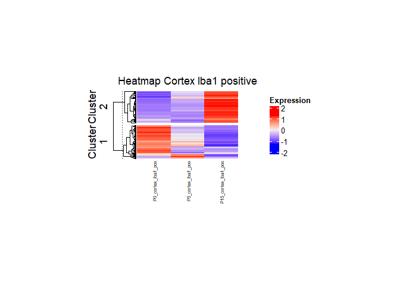

<!-- README.md is generated from README.Rmd. Please edit that file -->

# DgeaHeatmap

<!-- badges: start -->
<!-- badges: end -->

The goal of DgeaHeatmap is to enable R users to generate heatmaps more
easily and to help with preprocessing read counts. Furthermore, the
package is aimed to simplify the extraction of raw read counts from .dcc
and .pkc files generated through Nanostring GeoMx DSP.

## Installation

You can install the development version of DgeaHeatmap from
[GitHub](https://github.com/) with:

``` r
# install.packages("pak")
pak::pak("leolanci/Dgea_Heatmap_Package")
```

## Usage

This is a basic example which shows you how to solve a common problem:

``` r
library(DgeaHeatmap)
x <- 1
matrixCounts <- build_matrix(input_data, x)
```

|               | P0_cortex_Iba1_pos_1 | P0_cortex_Iba1_pos_2 | P0_cortex_Iba1_pos_3 | P0_cortex_Iba1_neg_1 |
|:--------------|---------------------:|---------------------:|---------------------:|---------------------:|
| Casp6         |                 10.5 |                 7.00 |                  2.8 |                 8.10 |
| Atl3          |                  7.0 |                13.99 |                  8.4 |                12.23 |
| C030006K11Rik |                 10.5 |                 7.00 |                  8.4 |                10.16 |
| Cflar         |                 10.5 |                17.49 |                  5.6 |                 7.22 |
| Aftph         |                  7.0 |                10.50 |                  8.4 |                11.78 |
| Tmem41b       |                  3.5 |                 7.00 |                  8.4 |                 6.63 |

``` r
parameter1 = "cortex"
parameter2 = "pos"
factors_for_individual_matrix = list(parameter1, parameter2)
indiMatrix <- individual_matrix(factors_for_individual_matrix, matrixCounts)
```

|               | P0_cortex_Iba1_pos_1 | P0_cortex_Iba1_pos_2 | P0_cortex_Iba1_pos_3 | P5_cortex_Iba1_pos_1 | P5_cortex_Iba1_pos_2 | P5_cortex_Iba1_pos_3 | P15_cortex_Iba1_pos_1 | P15_cortex_Iba1_pos_2 | P15_cortex_Iba1_pos_3 |
|:--------------|---------------------:|---------------------:|---------------------:|---------------------:|---------------------:|---------------------:|----------------------:|----------------------:|----------------------:|
| Casp6         |                 10.5 |                 7.00 |                  2.8 |                11.20 |                 4.66 |                16.79 |                  4.87 |                  9.80 |                 10.38 |
| Atl3          |                  7.0 |                13.99 |                  8.4 |                13.99 |                 9.33 |                 5.60 |                  8.92 |                 12.60 |                  7.67 |
| C030006K11Rik |                 10.5 |                 7.00 |                  8.4 |                13.99 |                 4.66 |                11.20 |                 10.55 |                 15.39 |                  7.67 |
| Cflar         |                 10.5 |                17.49 |                  5.6 |                13.99 |                18.66 |                 8.40 |                  9.74 |                 11.20 |                  9.03 |
| Aftph         |                  7.0 |                10.50 |                  8.4 |                 2.80 |                 4.66 |                 5.60 |                 16.23 |                  9.80 |                  9.03 |
| Tmem41b       |                  3.5 |                 7.00 |                  8.4 |                 5.60 |                 4.66 |                 5.60 |                  8.92 |                 16.79 |                  4.97 |

Filtering the matrix for only an x amount of most variable expressed
genes:

``` r
top_number_of_genes <- 500
varGenesMatrix <- filtering_for_top_exprGenes(indiMatrix, top_number_of_genes)
print(nrow(varGenesMatrix))
#> [1] 500
```

Using Z-score scaling to scale the values of the matrix:

``` r
scaled_counts <- scale_counts(varGenesMatrix)
```

How to visualize the data distribution of the scaled counts:

``` r
show_data_distribution(scaled_counts)
```


Generating an elbow plot to choose k for k-mean generation:

``` r
seed <- 1 # setting a seed for a reproducible outcome
elbow_plot(seed, scaled_counts)
```

 As
desired, the samples can further be summarized as biological replicates
to help generate more clearly arranged heatmaps and giving a better
overview.

``` r
probes <- list("P0_cortex_Iba1_pos", "P5_cortex_Iba1_pos", "P15_cortex_Iba1_pos")
sumBioRepsMatrix <- summarise_bio_replicates(scaled_counts, probes)
```

|         | P0_cortex_Iba1_pos | P5_cortex_Iba1_pos | P15_cortex_Iba1_pos |
|:--------|-------------------:|-------------------:|--------------------:|
| Hba-a1  |          0.2388201 |          0.6255464 |          -0.8643665 |
| Hbb-b1  |          0.1717879 |          0.7083344 |          -0.8801224 |
| Nrgn    |         -0.8124253 |         -0.3790624 |           1.1914877 |
| Gm52800 |          1.0355657 |          0.1047927 |          -1.1403584 |
| Lrr1    |          0.8561965 |         -0.0353765 |          -0.8208200 |
| Tuba1a  |          0.8549090 |          0.1379734 |          -0.9928824 |

Generating K-means for clustering in the heatmap:

``` r
seed <- 1 #set a seed for reproducibility, but try different seeds first
k_clusters <- 2
K_meanTable <- Kmean_generation(sumBioRepsMatrix, seed, k_clusters)
```

|         | P0_cortex_Iba1_pos | P5_cortex_Iba1_pos | P15_cortex_Iba1_pos |     |
|:--------|-------------------:|-------------------:|--------------------:|----:|
| Hba-a1  |          0.2388201 |          0.6255464 |          -0.8643665 |   1 |
| Hbb-b1  |          0.1717879 |          0.7083344 |          -0.8801224 |   1 |
| Gm52800 |          1.0355657 |          0.1047927 |          -1.1403584 |   1 |
| Lrr1    |          0.8561965 |         -0.0353765 |          -0.8208200 |   1 |
| Tuba1a  |          0.8549090 |          0.1379734 |          -0.9928824 |   1 |
| Gm52416 |          0.8877816 |          0.1610086 |          -1.0487902 |   1 |

The most variable genes of each cluster are selected through the
following function. A new object is created with the purpose of saving
the most variable genes for each cluster, while the matrix with included
cluster for each gene is divided into individual cluster matrices. These
matrices are each sorted by their variance.

``` r
number_of_annotations_per_cluster <- 5
k_clusters <- 2
mostVarGeneslist <- most_variable_genes(K_meanTable, number_of_annotations_per_cluster, k_clusters)
print(mostVarGeneslist)
#> [[1]]
#> [1] "Gm40862"
#> 
#> [[2]]
#> [1] "Rps17"
#> 
#> [[3]]
#> [1] "Fabp7"
#> 
#> [[4]]
#> [1] "Gm52432"
#> 
#> [[5]]
#> [1] "Ptma"
#> 
#> [[6]]
#> [1] "Pacsin1"
#> 
#> [[7]]
#> [1] "Clu"
#> 
#> [[8]]
#> [1] "Zfp365"
#> 
#> [[9]]
#> [1] "Diras2"
#> 
#> [[10]]
#> [1] "Purb"
```

To set the annotation for a heatmap the following function can be used:

``` r
number_of_annotations_per_cluster <- 5
annotation_for_heatmap <- set_annotation(sumBioRepsMatrix, number_of_annotations_per_cluster)
```

“performing_kMeans” is a function specifically written to perform k-mean
clustering outside of the general heatmap function. This allows a more
reliable splitting of the heatmap by their assigned clusters.

``` r
k_clusters <- 2
split_heatmap_clusters <- performing_kMeans(sumBioRepsMatrix, k_clusters)
```

``` r
colorPalette <- "RdBu"
color_setting(colorPalette)
#>  [1] "#053061" "#0A3B70" "#10467F" "#16518E" "#1B5C9E" "#2166AC" "#2870B1"
#>  [8] "#2F79B5" "#3682BA" "#3D8BBF" "#4695C4" "#569FC9" "#66A9CF" "#76B3D4"
#> [15] "#86BDDA" "#95C6DF" "#A2CDE2" "#AFD4E6" "#BCDAEA" "#C9E1ED" "#D4E6F0"
#> [22] "#DBEAF2" "#E3EDF3" "#EBF1F4" "#F3F5F6" "#F7F4F2" "#F8EEE8" "#FAE8DE"
#> [29] "#FBE3D4" "#FCDDCA" "#FBD4BE" "#FAC9B0" "#F8BEA2" "#F6B394" "#F4A886"
#> [36] "#EF9B7A" "#E98D6F" "#E37E64" "#DD7059" "#D7624F" "#D05447" "#C84540"
#> [43] "#C13639" "#BA2832" "#B2192B" "#A41328" "#940E26" "#850923" "#760421"
#> [50] "#67001F"
```

Finally, a heatmap with clusters can be generated as in this example:

``` r
seed <- 1
title <- "Heatmap Cortex Iba1 positive"
fontsize_columnNames <-6
fontsize_rowNames <-4
title_heatmap_legend <- "Expression"
WidthNum <- 4.5
HeightNum <- 3
UnitSize <- "cm"
colorPalette <- "RdBu"
print_heatmap(seed, sumBioRepsMatrix, title, split_heatmap_clusters, annotation_for_heatmap, fontsize_columnNames, fontsize_rowNames, title_heatmap_legend, WidthNum, HeightNum, UnitSize, colorPalette)
```



In that case, don’t forget to commit and push the resulting figure
files, so they display on GitHub and CRAN.
